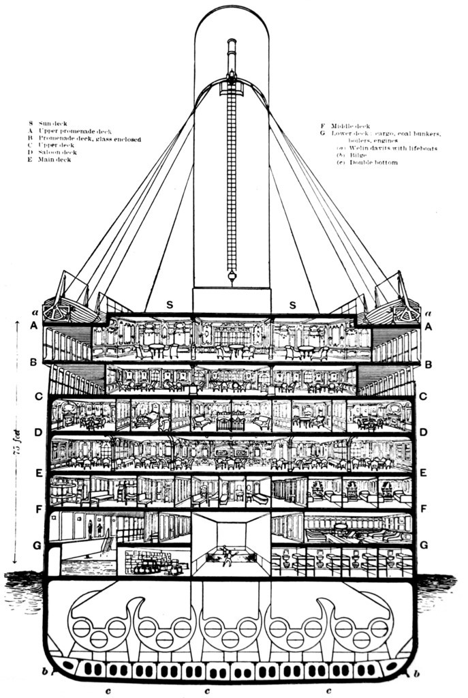

# 学习如何组织一个机器学习项目(Titanic)
## images
图片
- `structure_titanic.jpg`泰坦尼克号截面
    
- `Titanic_side.jpg`侧面结构图
    

## input
输入文件。如果是NLP项目，可以将embeddings放在这里；如果是图像项目，所有图像都放在该文件夹下的子文件夹。
- `gender_submission.csv`提交文件示例
- `test.csv`测试集，要预测的文件
- `test_final.csv`清洗和特征工程之后的测试集
- `train.csv`训练集
- `train_fianl.csv`清洗和特征工程之后的训练集

## models
所有训练过的模型
|模型      |测试得分   |提交得分   |备注      |
| -------- | -------- | -------- | -------- |
|refer3|None|0.81100|参考三|
|refer1|None|0.79186|参考一|
|svc_linear.pkl|0.82826|0.77511|支持向量机使用linear核函数|
|svc_poly.pkl|0.83724|0.77511|支持向量机使用poly核函数|
|svc_rbf.pkl|0.83387|0.77511|支持向量机使用rbf核函数|
|svc_sigmoid.pkl|0.76543|0.73684|支持向量机使用sigmoid核函数|
|decissiontree.pkl|0.83836|0.77990|最佳的决策树|
|randomforest.pkl|None|None|最佳的随机森林|
|bayes_gaussian.pkl|0.81704|0.75358|基于高斯分布的朴素贝叶斯|
|bayes_bernoulli.pkl|0.80470|None|基于伯努利分布的朴素贝叶斯|
|knn.pkl|0.82263|0.77751|K近邻算法|
|adaboost.pkl|0.82269|0.74641|adaboost算法，基学习器为决策树树桩|
|lightgbm.pkl|0.84287|0.76315|lightgbm算法，没有精调|

## notebook
所有jupyter notebook文件
- `deepseek.ipynb` 人工智能助手DeepSeek
- `reference.ipynb` 参考笔记
- `titanic.ipynb` 数据详情，数据清洗，特征工程
- `tools.py` 各种工具

## src
所有python脚本
`titanic.py` 模型的训练
`tools.py` 各种工具的合集

## submission
所有的提交文件
`refer1.csv` 参考1中生成的提交
`refer3.csv` 参考3中生成的提交
`submission.csv` 提交示例
## LICENSE
许可证
`MIT License`
特点: 非常宽松，允许他人几乎无限制地使用代码，只需保留原作者的版权声明和许可声明。适用场景: 适合希望代码被广泛使用的项目。

## 经验总结

## 参考
1. [Titanic Competition: EDA & FE & Model](https://www.kaggle.com/code/mariyamalshatta/titanic-competition-eda-fe-model)
2. [Titanic - Advanced Feature Engineering Tutorial](https://www.kaggle.com/code/gunesevitan/titanic-advanced-feature-engineering-tutorial)
3. [Titanic: on the top with a simple model](https://www.kaggle.com/code/goldens/titanic-on-the-top-with-a-simple-model)