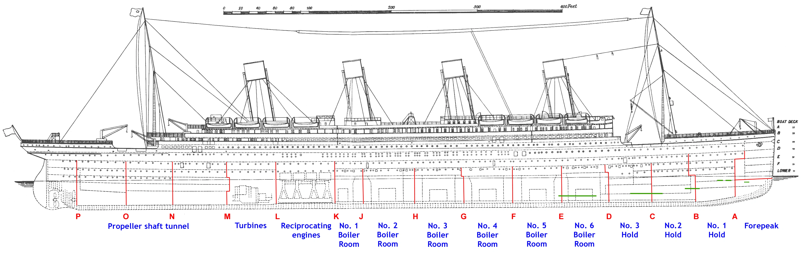

# 学习如何组织一个机器学习项目(Titanic)
## images
图片
- `structure_titanic.jpg`泰坦尼克号截面
    
- `Titanic_side.jpg`侧面结构图
    
## input
输入文件。如果是NLP项目，可以将embeddings放在这里；如果是图像项目，所有图像都放在该文件夹下的子文件夹。
- `gender_submission.csv`提交文件示例
- `test.csv`测试集，要预测的文件
- `train.csv`训练集
## src
所有python脚本
## models
所有训练过的模型，以及模型预测的结果
## notebook
所有jupyter notebook文件
## LICENSE
许可证
`MIT License`
特点: 非常宽松，允许他人几乎无限制地使用代码，只需保留原作者的版权声明和许可声明。适用场景: 适合希望代码被广泛使用的项目。
## 参考
[Titanic Competition: EDA & FE & Model](https://www.kaggle.com/code/mariyamalshatta/titanic-competition-eda-fe-model)
[Titanic - Advanced Feature Engineering Tutorial](https://www.kaggle.com/code/gunesevitan/titanic-advanced-feature-engineering-tutorial)
[Titanic: on the top with a simple model](https://www.kaggle.com/code/goldens/titanic-on-the-top-with-a-simple-model)